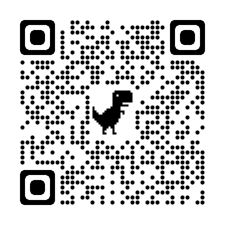
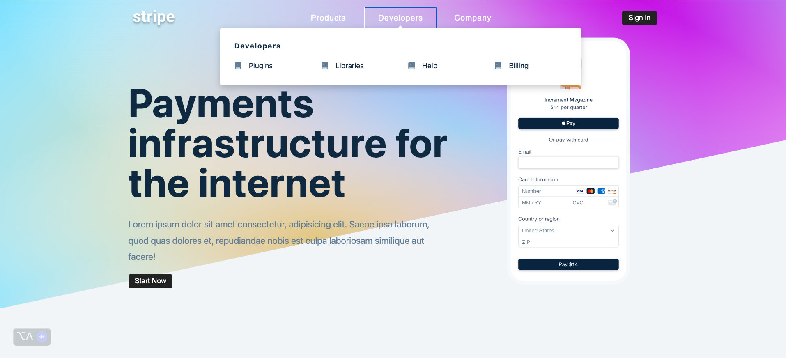
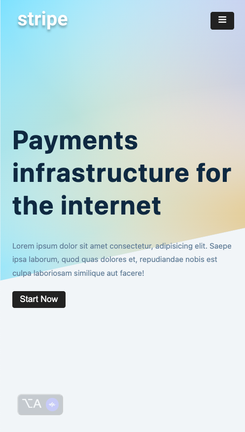
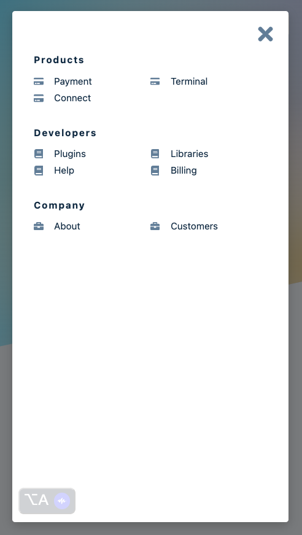

# Submenu

This project was bootstrapped with [Create React App](https://github.com/facebook/create-react-app).

#### Github Page Link

[ 🧭 Submenu - project demo](https://jovyflagg.github.io/submenu)

or scan QR Code:



[](https://www.loom.com/share/625f019df9f447aab6752bbe78fedc37?sid=3b96000a-8ca1-4535-9b34-42a07adfdcf8)





#### Credits:

#### React Icons

[react icons](https://react-icons.github.io/react-icons/)

```
npm install react-icons --save
```

```javascript
import { FaTwitter } from 'react-icons/fa';

const Component = () => {
  return <FaTwitter className='icon'></FaTwitter>;
};
```

* John Smilga / CodingAddict YT channel
* freeCodeCamp.org
* [15 React Projects](https://www.youtube.com/watch?v=a_7Z7C_JCyo&t=614s)
